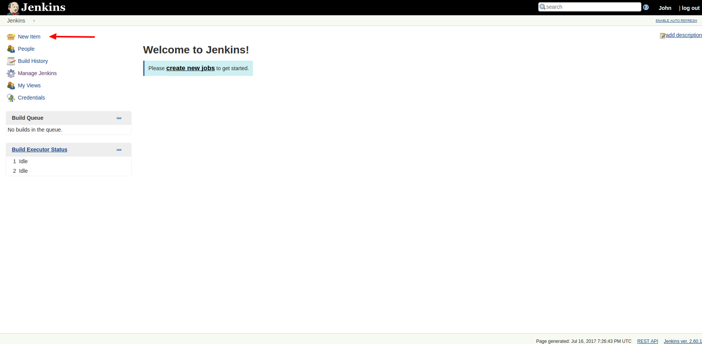
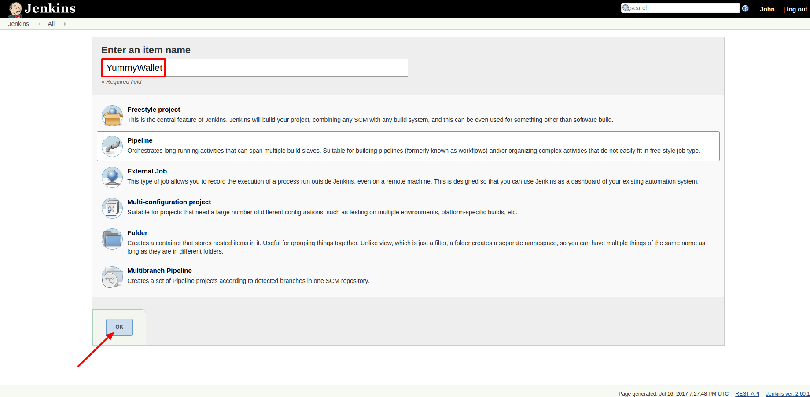
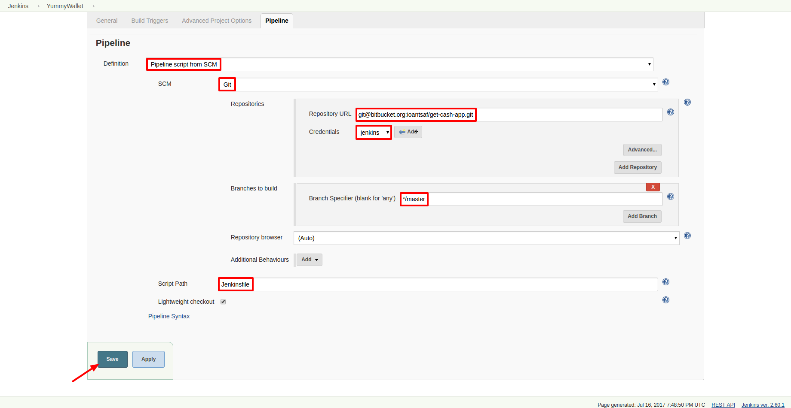
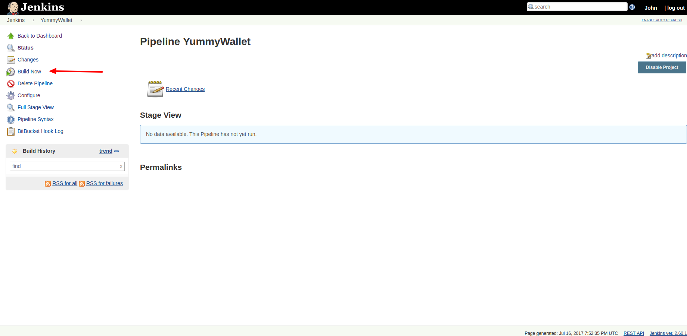
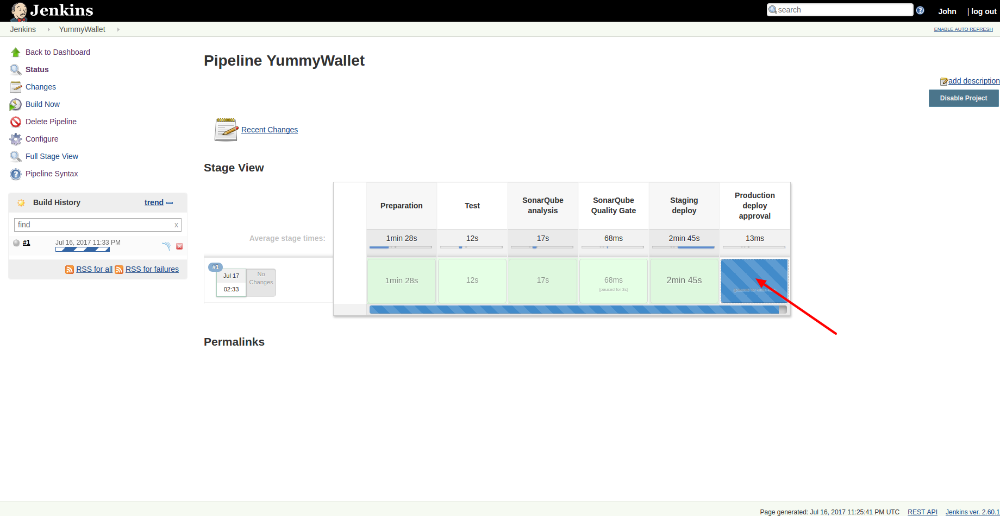

# Δημιουργία CI project στο Jenkins

Στο βήμα αυτό, δημιουργούμε ένα νέο CI project, στο Jenkins. Χρησιμοποιείται scripted pipeline, μέσω αρχείου Jenkinsfile, το οποίο έχει δημιουργηθεί εκ των προτέρων, και βρίσκεται checked out στο source control repository, μέσα στο project.  
Για περισσότερες πληροφορίες για την συγγραφή του Jenkinsfile, μπορούμε να απευθυνθούμε στο [Jenkins documentation](https://jenkins.io/doc/book/pipeline/jenkinsfile), είτε στα παραδείγματα, που υλοποιήθηκαν ως μέρος της εργασίας.

Επιλέγουμε "New item":

Εισάγουμε το όνομα του project μας, επιλέγουμε "Pipeline", και πατάμε "OK":

Στο πεδίο Definition, ορίζουμε "Pipeline script from SCM". Ως SCM, επιλέγουμε το Git.  
Στο Repository URL, εισάγουμε το SSH clone URL του αποθετηρίου, όπου βρίσκεται ο κώδικάς μας.  
Στα credentials, επιλέγουμε τα credentials, που εισάγαμε στο βήμα ["Ρύθμιση του κλειδιού SSH στο Jenkins"](ssh_credentials.md).  
Επιλέγουμε το Script Path του Jenkinsfile μας, σχετικά με το root του project. Προτιμάται να βρίσκεται στο root του project, όπως στο παράδειγμα.  
Τέλος, πατάμε "Save":

Το CI pipeline μας είναι έτοιμο.

Για να το τρέξουμε, πατάμε "Build Now":

Εναλλακτικά, το pipeline μπορεί να τρέχει αυτόματα κάθε φορά που γίνεται commit, μέσω [SCM trigger](scm_trigger.md).

Στην παρακάτω εικόνα βλέπουμε ένα CI pipeline, το οποίο έχει περάσει επιτυχώς όλα τα CI στάδια, και έχει γίνει deploy σε staging.  
Το pipeline περιμένει ανθρώπινη παρέμβαση, για την αποδοχή ή απόρριψη του deployment στο production.  
Για να κάνουμε αυτή την επιλογή, πατάμε πάνω στο μπλε παραλληλόγραμμο, στο "Production deploy approval" στάδιο:

