# Παραμετροποίηση του Jenkins

Κατά το βήμα αυτό, πραγματοποιείται η αρχική παραμετροποίηση και η εγκατάσταση των plugins του Jenkins CI.

### Ξεκλείδωμα του web interface

Για το ξεκλείδωμα του Jenkins web interface, θα πρέπει να κάνουμε SSH στο VM, όπου τρέχει το CI. Στη συνέχεια, θα πρέπει να τρέξουμε την εντολή `cat /opt/jenkins/secrets/initialAdminPassword`, και να κάνουμε copy-paste τον κωδικό, στο textbox που εμφανίζεται:
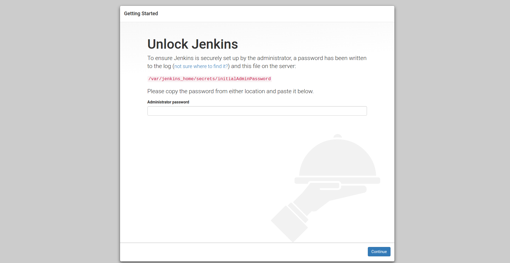

### Εγκατάσταση αρχικών plugins

Επιλέγουμε "Select plugins to install":
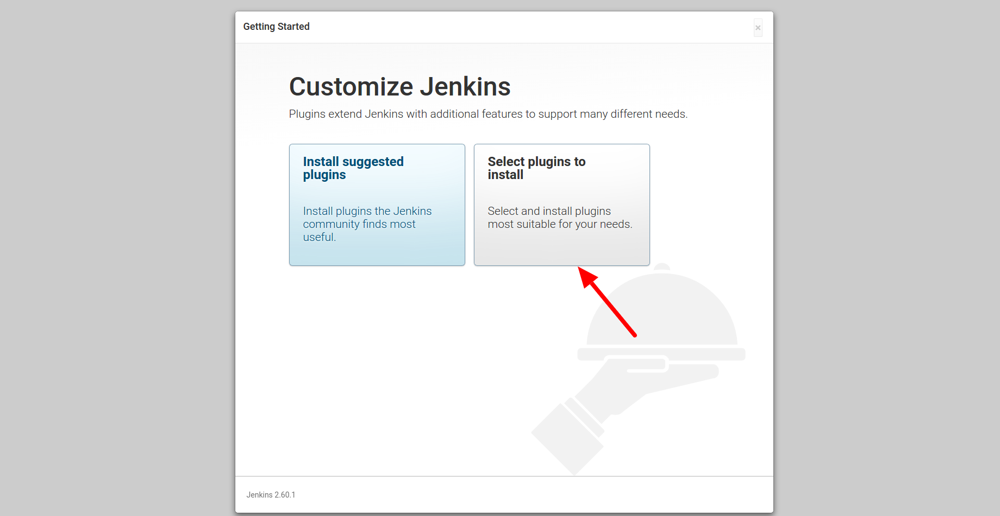

Στη συνέχεια, επιλέγουμε τα plugins, που πρέπει να εγκατασταθούν:

* build timeout plugin
* Timestamper
* Workspace Cleanup Plugin
* NodeJS Plugin (αν το project είναι NodeJS)
* Pipeline
* Pipeline: Stage View Plugin
* Bitbucket Plugin (αν χρησιμοποιούμε Bitbucket)
* Git plugin
* Άλλα επιθυμητά plugins (π.χ. Mailer Plugin, αν θέλουμε ειδοποιήσεις μέσω mail, κ.ά.)

Στη συνέχεια, πατάμε "Install":
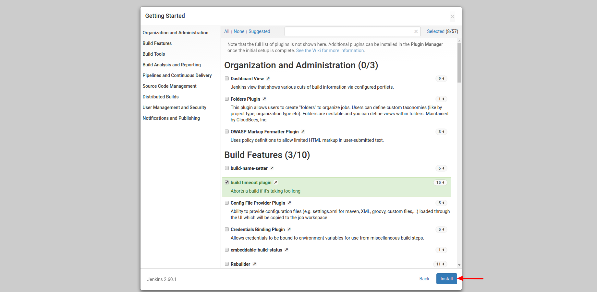

### Δημιουργία χρήστη

Εισάγουμε τα στοιχεία του χρήστη, που θέλουμε να δημιουργήσουμε, και πατάμε "Save and Finish":
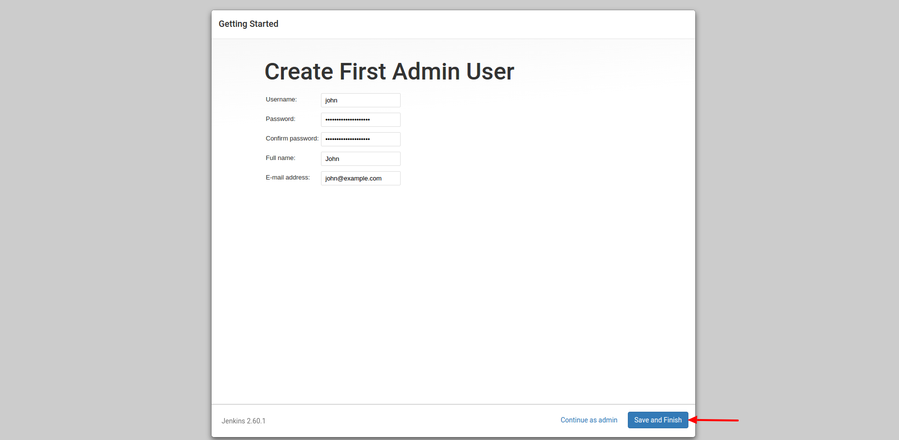

### Εγκατάσταση επιπλέον plugins

Επιλέγουμε Manage Jenkins:
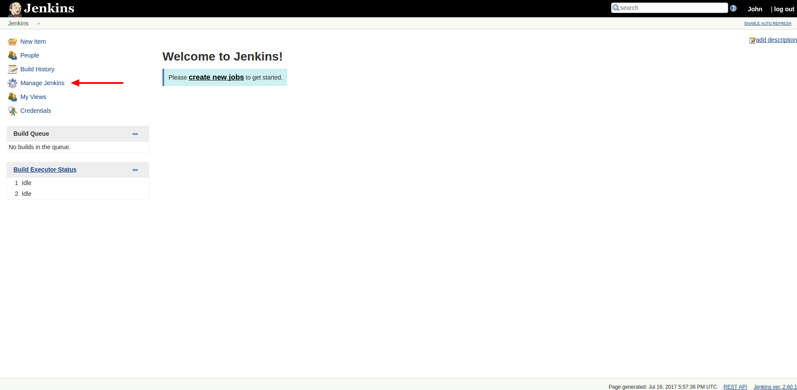

Επιλέγουμε Manage Plugins:
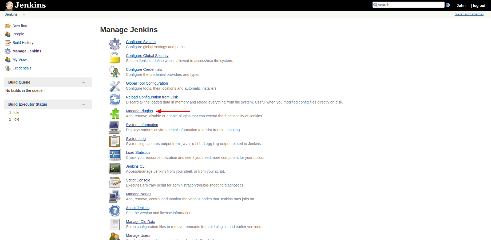

Πηγαίνουμε στη λίστα με τα Available plugins, και επιλέγουμε τα:

* Ansible plugin
* AnsiColor
* Environment Injector Plugin
* SonarQube Scanner for Jenkins
* Blue Ocean (αν θέλουμε να χρησιμοποιήσουμε το νέο Jenkins UI)

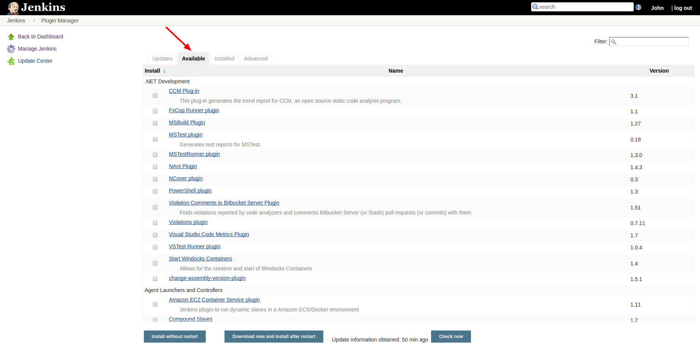

Πατάμε "Download now and install after restart":
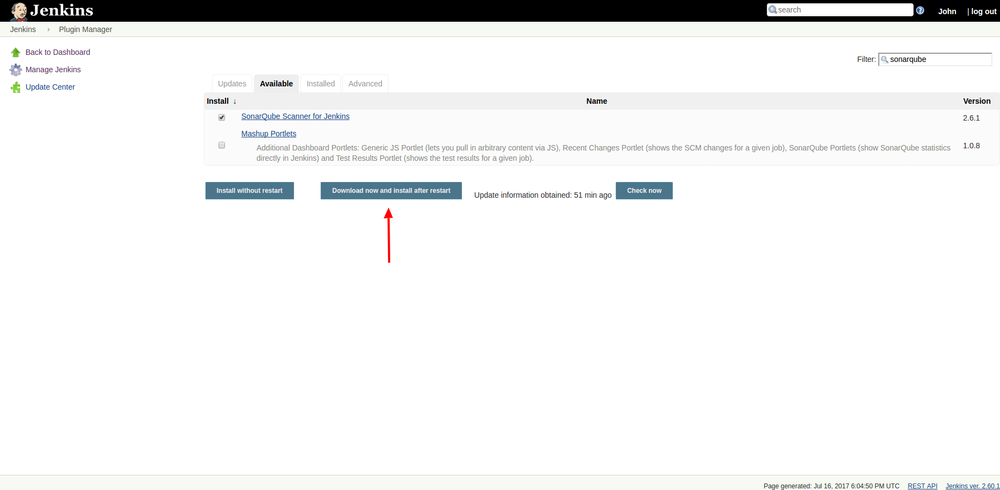

Επιλέγουμε "Restart Jenkins when installation is complete and no jobs are running":
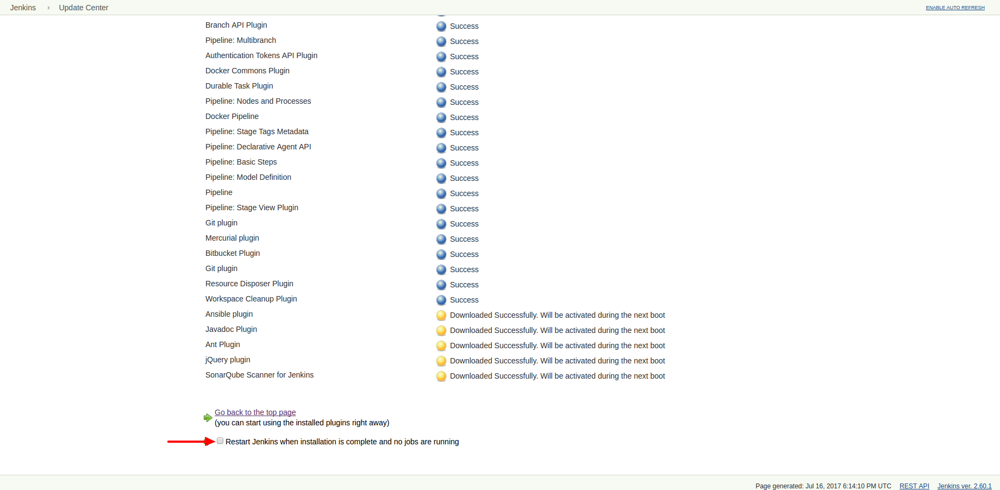

### Παραμετροποίηση των plugins

Στη σελίδα "Manage Jenkins", επιλέγουμε "Global Tool Configuration":
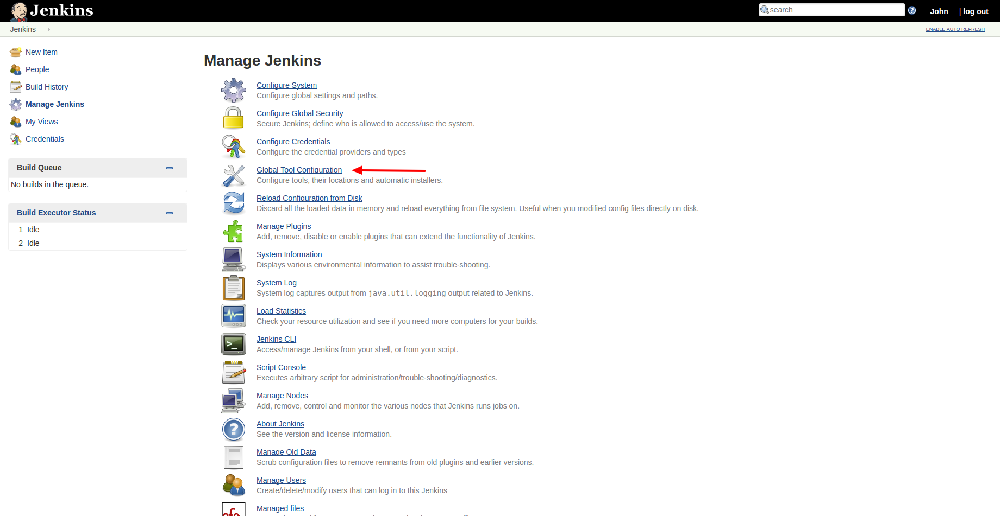

Πατάμε "Add SonarQube Scanner".  
Εισάγουμε ως Name "sonar scanner", και αφήνουμε τις υπόλοιπες επιλογές ως έχουν:
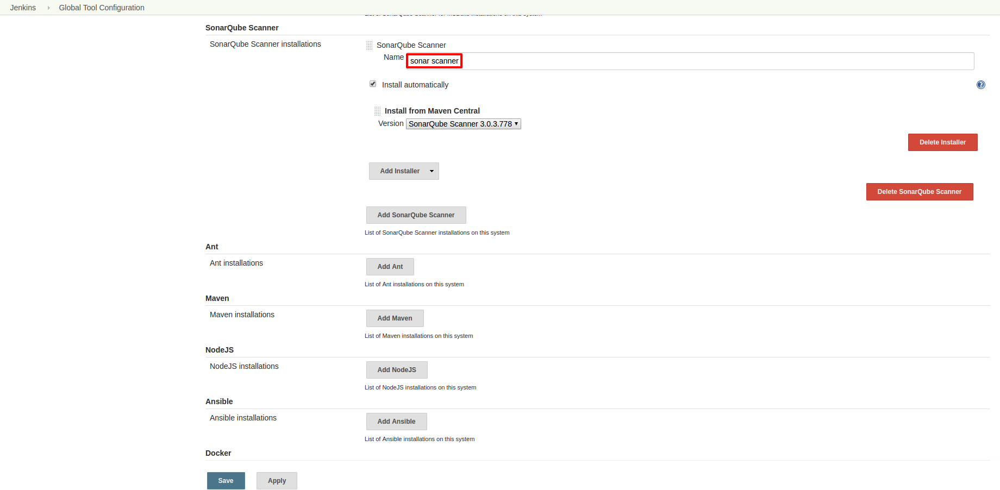

Πατάμε "Add NodeJS".  
Εισάγουμε ως Name "recent node", και αφήνουμε τις υπόλοιπες επιλογές ως έχουν:
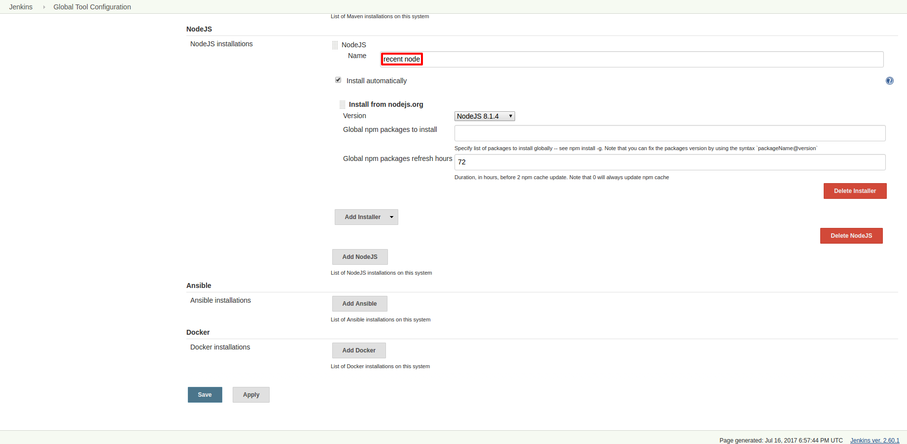

Πατάμε "Save", στο κάτω μέρος της σελίδας:
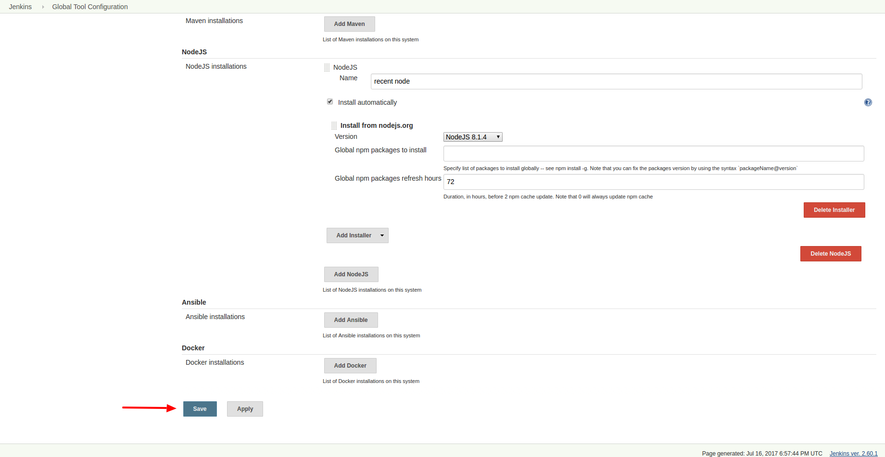
