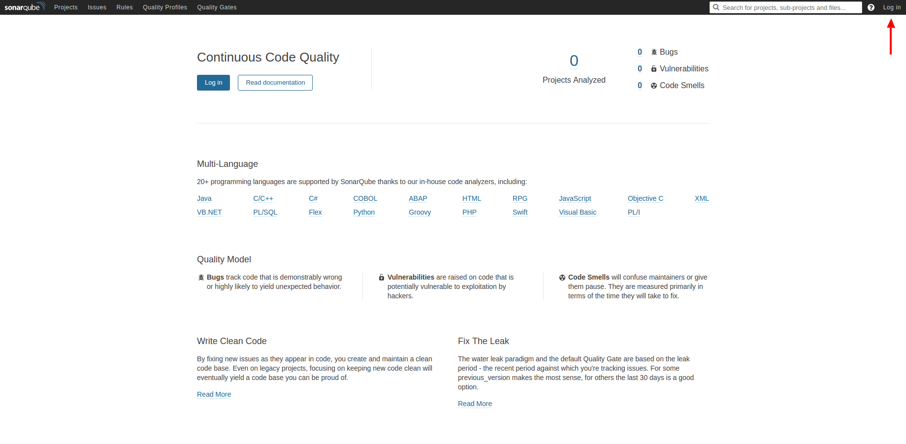
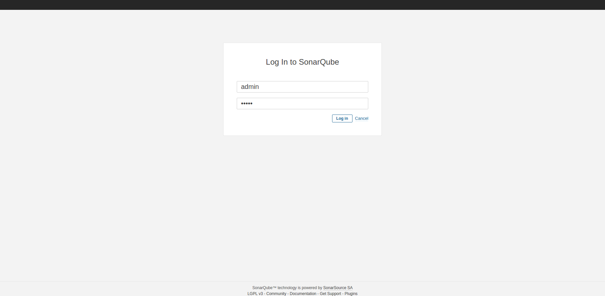
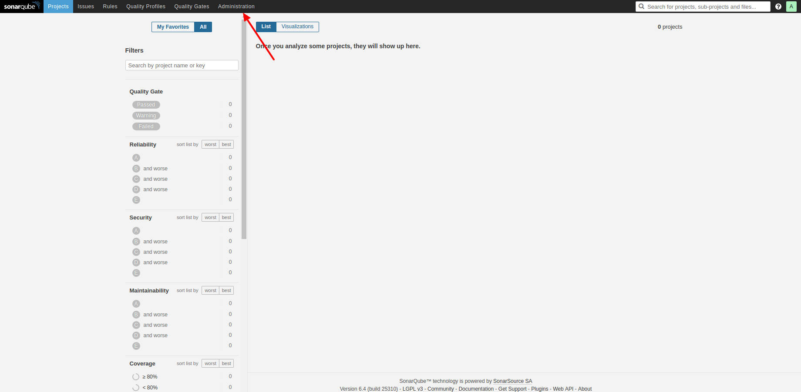
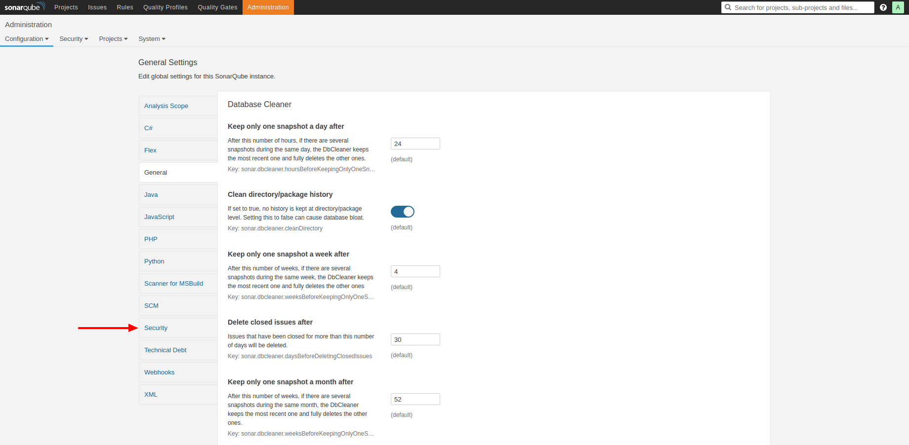
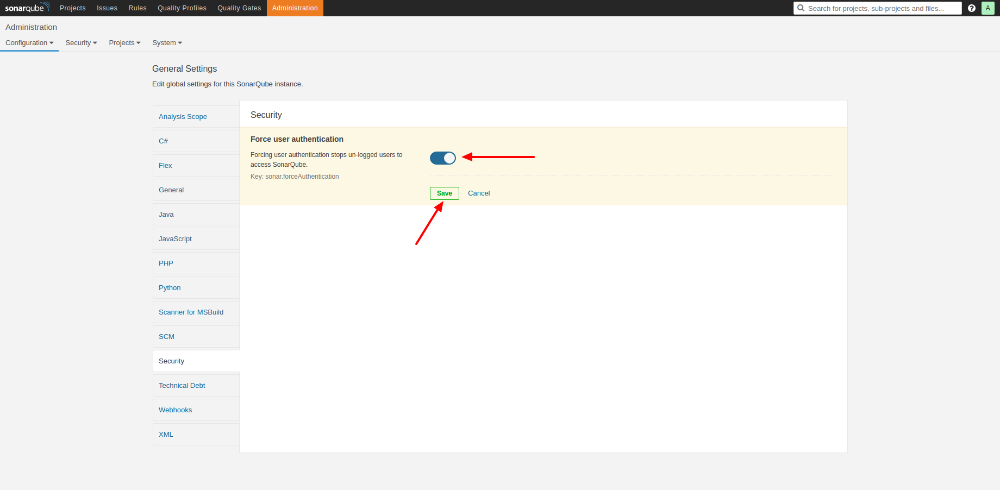
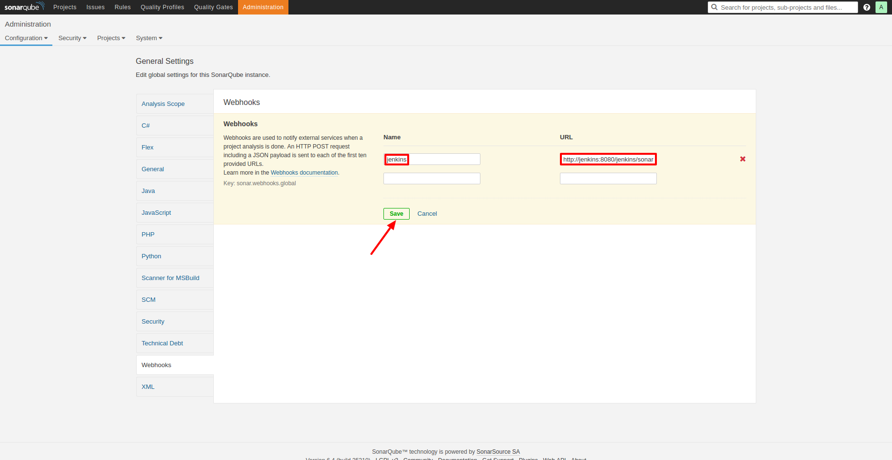
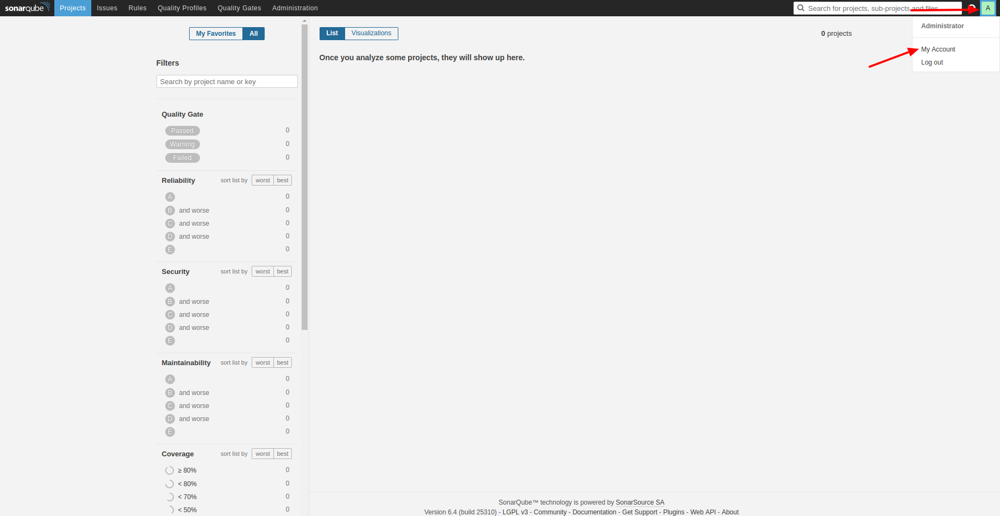
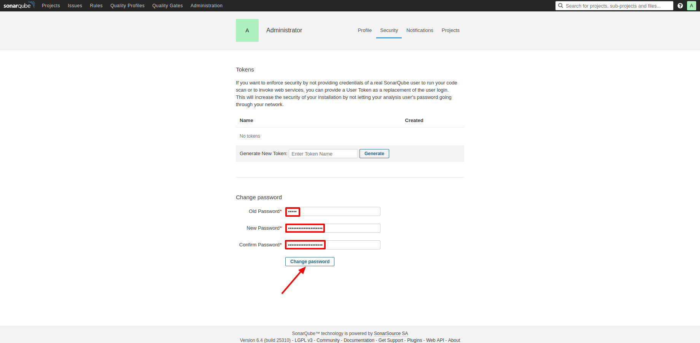
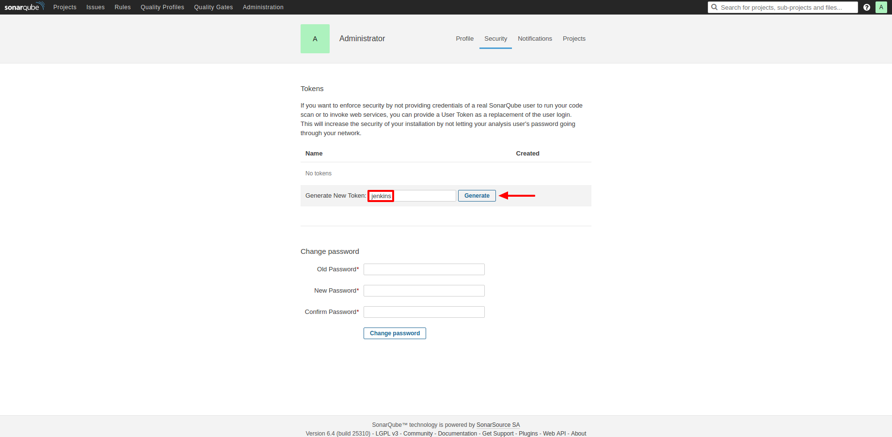
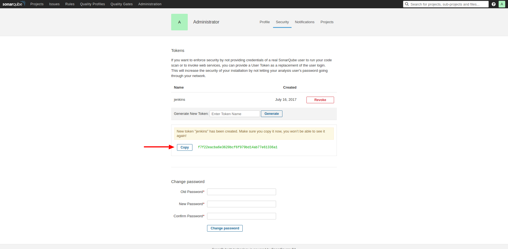

# Παραμετροποίηση του SonarQube

Κατά το βήμα αυτό, πραγματοποιείται η αρχική παραμετροποίηση του SonarQube.

### Είσοδος στο SonarQube

Πατάμε "Log in", και βάζουμε ως username/password, admin/admin:

### Αλλαγή ρυθμίσεων ασφαλείας

Επιλέγουμε "Administration":

Πηγαίνουμε στην κατηγορία "Security", και ενεργοποιούμε το "Force user authentication":

Με τον τρόπο αυτό, τα projects μας δεν θα είναι ορατά, αν δεν έχουμε κάνει login.

### Ενεργοποίηση του Jenkins webhook

Στο menu "Administration", πηγαίνουμε στην κατηγορία "Webhooks".  
Εισάγουμε ένα καινούργιο webhook, με όνομα jenkins, και URL: `http://jenkins:8080/jenkins/sonarqube-webhook/`:

Το URL αυτό αποτελεί το URL του Jenkins, στο εσωτερικό Docker network. Με τη χρήση του webhook, επιτυγχάνουμε την ενημέρωση του SonarQube Quality Gate, που θα ενσωματώσουμε στα Jenkins CI Pipelines.

### Αλλαγή κωδικού πρόσβασης ασφαλείας, και δημιουργία Jenkins token

Πατάμε το σύμβολο "A", στην πάνω δεξιά γωνία, και επιλέγουμε "My Account":

Στην φόρμα "Change password", εισάγουμε ως παλιό κωδικό "admin", και ως νέο, τον επιθυμητό κωδικό.
Στη συνέχεια, πατάμε "Change password":

Στην φόρμα "Generate New Token", εισάγουμε "jenkins", και πατάμε "Generate":

Τέλος, πατάμε "Copy", για να αντιγράψουμε το token στο clipboard:

Το token αυτό χρησιμοποιείται στην [σύνδεση του Jenkins με το SonarQube](jenkins-sonarqube.md).
