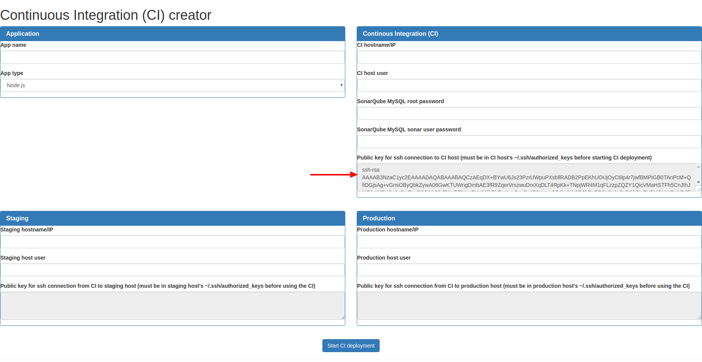
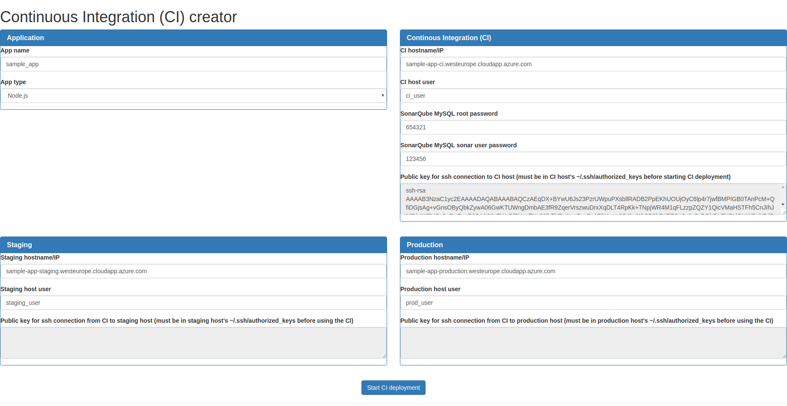
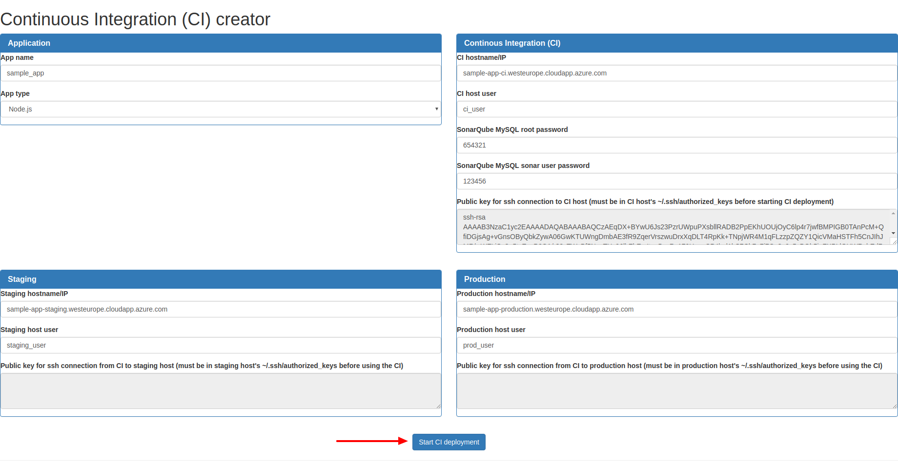
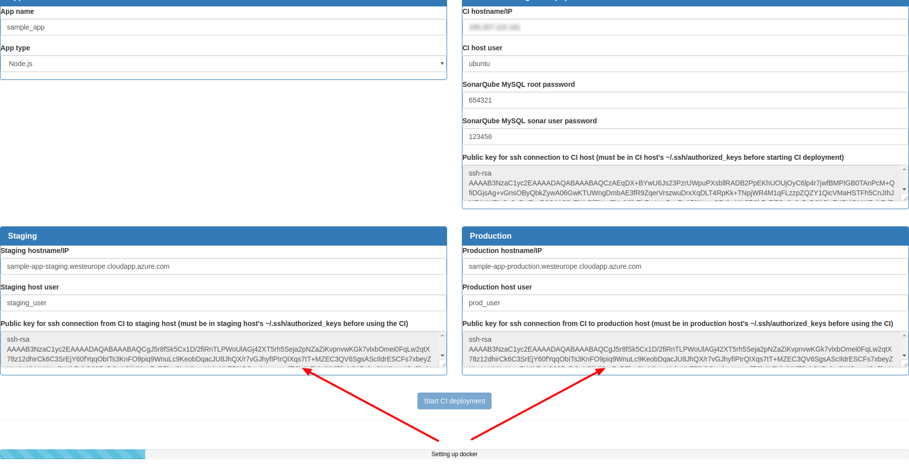
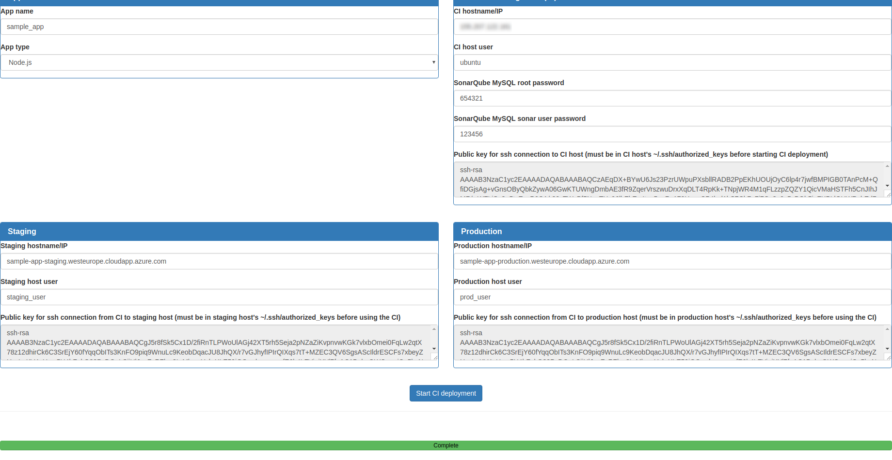

# Δημιουργία ενός CI μέσω του CI creator

Στο βήμα αυτό περιγράφεται η διαδικασία δημιουργίας ενός CI, μέσω του CI creator. Η διαδικασία έχει σχεδιαστεί για διανομές των CI, staging, production hosts βασισμένες σε Debian, και έχει δοκιμαστεί σε Ubuntu Server 16.04.

### Εισαγωγή δημόσιου κλειδιού (public key) στο CI host

Για να γίνει εφικτό το deployment των υπηρεσιών CI, στο CI host, πρέπει το public key του ζεύγους κλειδιών του CI creator, να εισαχθεί στο CI host. Το public key του CI creator δίνεται στον πίνακα Continous Integration (CI):

Το κλειδί αυτό πρέπει να αντιγραφεί, και να επικολληθεί στο ~/.ssh/authorized_keys του CI host, για τον χρήστη, ο οποίος πρόκειται να χρησιμοποιηθεί (μέσα από αυτόν θα τρέξουν τα Docker containers).

### Στοιχεία της φόρμας του CI creator

Στην φόρμα του CI creator, πρέπει να συμπληρώσουμε όλα τα στοιχεία, που αφορούν το app μας, καθώς και τα CI, staging, production hosts.  
Στο app name χρειάζεται προσοχή να συμπληρωθεί σωστά το όνομα του project. Ειδικά στην περίπτωση ενός Django app, πρέπει να συμπίπτει με το όνομα του remote repository, που θα χρησιμοποιηθεί για το project.  
Όσον αφορά τα hostnames/IPs, πρέπει να προσέξουμε να μην έχουν http(s) prefix, καθώς οι συνδέσεις γίνονται μέσω SSH.  
Η απομνημόνευση των κωδικών της SonarQube MySQL είναι μικρής σημασίας, καθώς θα χρειαστούν μόνο αν θελήσουμε να έχουμε απευθείας πρόσβαση στη βάση. Προτείνεται η χρήση δυνατών κωδικών.  
Όσον αφορά τους χρήστες, που θα χρησιμοποιηθούν στα staging/production hosts, θα πρέπει να ξέρουμε ότι αυτοί θα τρέχουν το webapp. Η τελική σελίδα σερβίρεται όμως στο internet μέσω του apache, ο οποίος τρέχει μέσω άλλου χρήστη. Αν το app μας είναι Jetty, τρέχει μέσω του χρήστη jetty.  
Παράδειγμα της συμπληρωμένης φόρμας φαίνεται παρακάτω:

### Έναρξη διαδικασίας CI creation

Για την έναρξη της διαδικασίας CI creation, αφού συμπληρώσουμε σωστά τη φόρμα, πατάμε στο "Start CI deployment":

Σε μια μπάρα προόδου, εμφανίζονται τα 6 βήματα της δημιουργίας:

* ci
* docker
* jenkins
* mysql
* sonarqube
* apache

### Public keys για staging και production hosts

Μετά την ολοκλήρωση του πρώτου βήματος της δημιουργίας, εμφανίζονται τα public keys, που θα χρησιμοποιηθούν για το SSH, από τον CI host, στους staging και production hosts, στα αντίστοιχα σημεία.  
Τα κλειδιά αυτά πρέπει να εισαχθούν στα staging και production hosts, στα ~/.ssh/authorized_keys των αντίστοιχων χρηστών, έτσι ώστε να είναι εφικτό το αυτόματο deployment του app σε staging και production, μέσω του CI process.

### Ολοκλήρωση της δημιουργίας του CI

Κατά την ολοκλήρωση της δημιουργίας του CI, η μπάρα προόδου εμφανίζεται πράσινη, και γράφει "Complete":

Η διαδικασία δημιουργίας του CI διαρκεί από 10 μέχρι 20 λεπτά.  
Μετά το πέρας της διαδικασίας, πρέπει να ακολουθηθούν τα βήματα παραμετροποίησης των υπηρεσιών CI.

Παρακάτω, βλέπουμε την αρχική σελίδα του CI, που δημιουργήθηκε:

