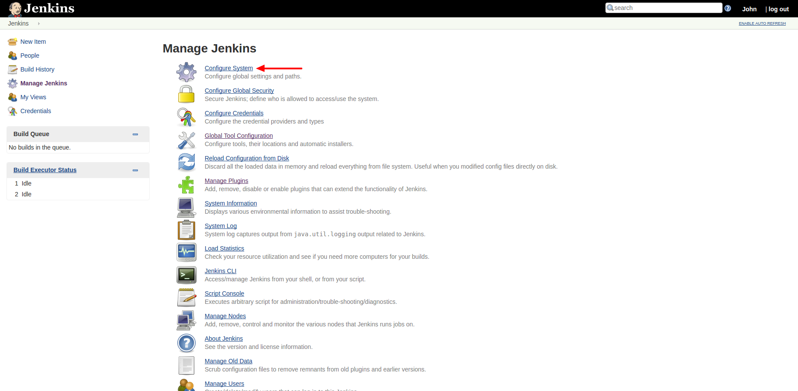

# Σύνδεση του Jenkins με το SonarQube

Κατά το βήμα αυτό, η εφαρμογή του Jenkins συνδέεται με το SonarQube, ώστε να είναι δυνατή η στατική ανάλυση κώδικα, ως μέρος του CI process.

### Εισαγωγή των στοιχείων του SonarQube server

Στη σελίδα "Manage Jenkins", επιλέγουμε "Configure System":

Πατάμε "Add SonarQube".  
Στο "Name", εισάγουμε "sonar server".  
Στο "Server URL" εισάγουμε: `http://sonarqube:9000/sonarqube`.  
Στο "Server authentication token", εισάγουμε το token, που αντιγράψαμε στο τελευταίο βήμα της [παραμετροποίησης του SonarQube](configure_sonarqube.md):

Τέλος, πατάμε "Save", στο κάτω μέρος της σελίδας:

