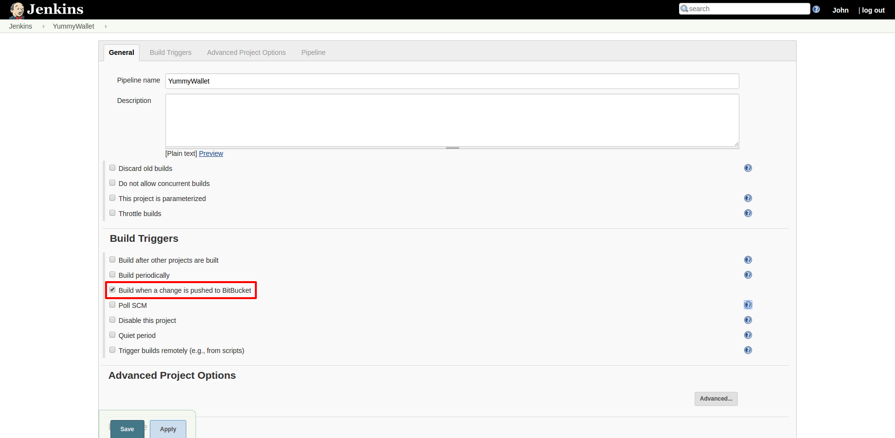
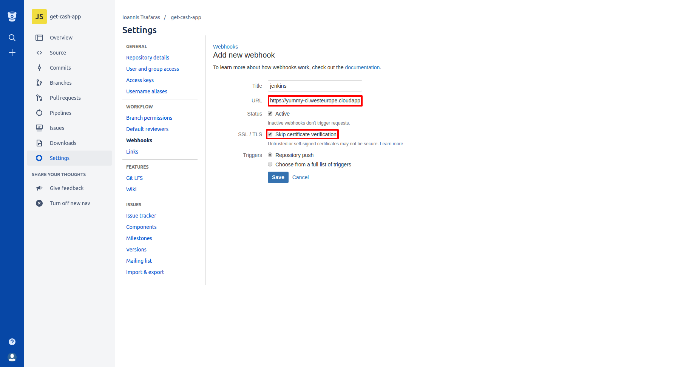

# Ρύθμιση αυτόματου SCM build trigger

Τα παρακάτω βήματα πρέπει να εφαρμοστούν, ώστε να πραγματοποιείται αυτόματο CI build, ενός Jenkins Pipeline, όταν γίνεται κάποιο commit.

Στο Jenkins frontend, στις ρυθμίσεις του project, στην κατηγορία "Build Triggers", επιλέγουμε "Build when a change is pushed to Bitbucket" (στο παράδειγμά μας χρησιμοποιούμε BitBucket):

Στη συνέχεια, για να στέλνεται trigger από το BitBucket, στον CI server, στα Settings -> Webhooks του BitBucket, εισάγουμε ένα νέο webhook, με ένα επιθυμητό όνομα. Χρησιμοποιούμε το URL: `https://<ci_server_url>/jenkins/bitbucket-hook/`.  
Επιλέγουμε το checkbox "Skip certificate verification", και κάνουμε "Save":

