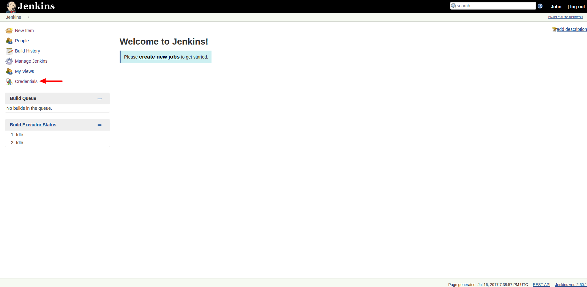
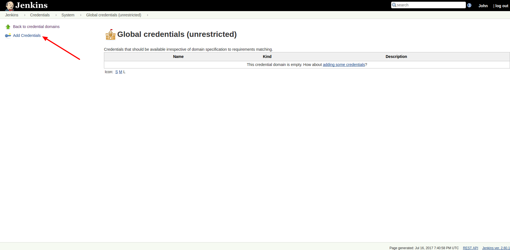
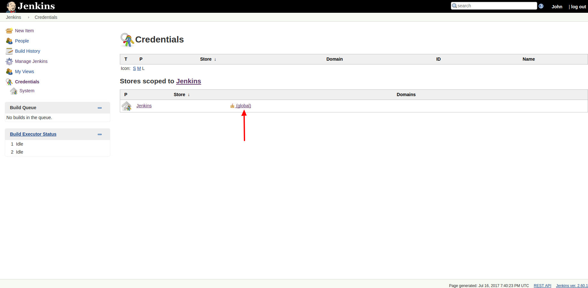
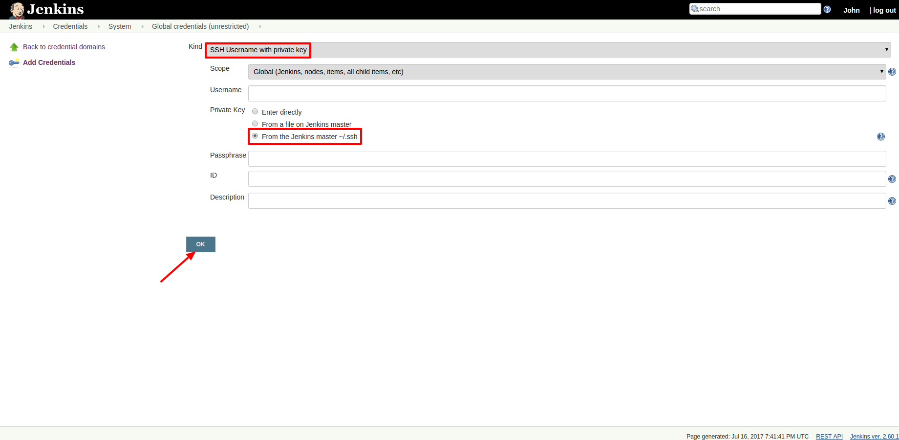
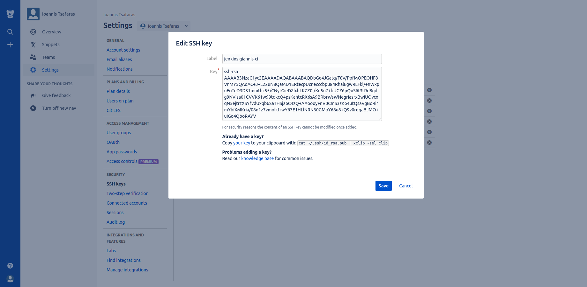

# Ρύθμιση του κλειδιού SSH στο Jenkins

Η ρύθμιση του ζεύγους SSH κλειδιών, που ήδη υπάρχει στο CI VM, μέσα στο Jenkins CI, χρησιμεύει τόσο στην πρόσβαση σε online αποθετήρια κώδικα, όπως το GitHub και το BItBucket, όσο και στην πρόσβαση στα staging και production hosts, για το αυτόματο deployment της εφαρμογής.

### Εισαγωγή του ζεύγους κλειδιών στο Jenkins

Επιλέγουμε "Credentials":

Επιλέγουμε "Add Credentials":

Πατάμε "(global)":

Επιλέγουμε "SSH Username with private key".  
Στο πεδίο "Private Key" επιλέγουμε "From the Jenkins master ~/.ssh".  
Στη συνέχεια, πατάμε "OK":

### Εισαγωγή του δημόσιου κλειδιού σε online SCM (GitHub, BitBucket κ.ά.)

Για να εισάγουμε το δημόσιο κλειδί σε κάποιο online SCM, είτε το αντιγράφουμε από τον CI creator, κατά τη δημιουργία του CI, είτε συνδεόμαστε μέσω SSH στο CI VM, και τρέχουμε την εντολή `cat /opt/jenkins/.ssh/id_rsa.pub`, που θα μας εμφανίσει το δημόσιο κλειδί.

Για την περίπτωση του BitBucket, πηγαίνουμε στα Settings -> SSH keys, και δημιουργούμε μία νέα καταχώρηση, όπου επικολλούμε το δημόσιο κλειδί:

